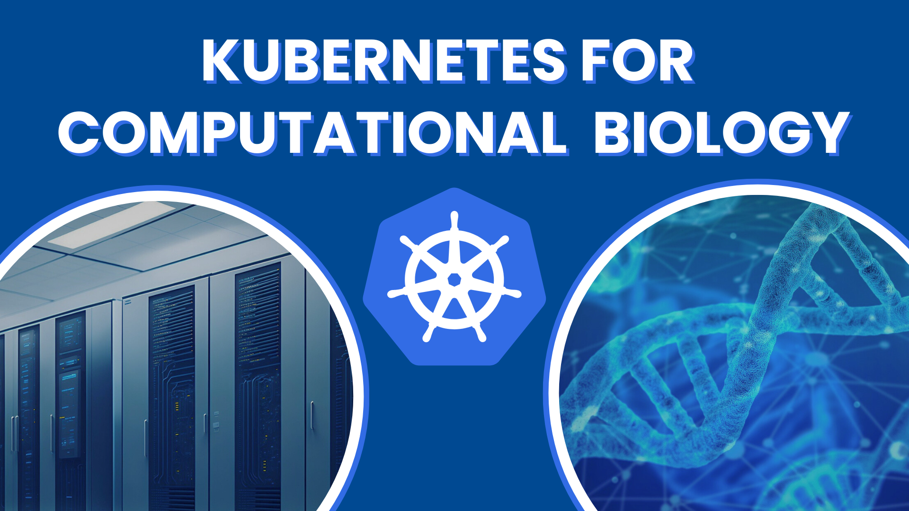

# Kubernetes for Computational Biology

Welcome to this hands-on Kubernetes workshop designed specifically for computational biomedical workflows. This workshop will guide you through the fundamentals of Kubernetes and provide practical templates for common bioinformatics use cases.

## Structure

1. Introduction to Kubernetes: 15 minutes presentation about the core principles of Kubernetes and our concrete cluster
2. Demonstration: 15 minutes of demonstration how to work with Kubernetes (only requirement: working kubectl + config) - showcase the 3 usecases - in a nutshell - what to expect from those examples
3. Practical Session: 30 minutes of reproducing 1 blueprint for each participant

## Prerequisites for the practical session

- Basic command line knowledge
- Docker concepts (containers, images)
- Access to the provided Kubernetes cluster
- `kubectl` installed and configured (test with ```kubectl get pods```)
- install envsubst (needed for replacing text in yaml files)

## Howto use this repository

1. Clone this repository
2. Copy `.env.example` to `.env` and fill in your specific values
3. enter a numbered folder (i.e. 01_gpu)
4. execute the respective run.sh script

---

## 1. Kubernetes Overview

### What is Kubernetes?

Kubernetes (K8s) is a container orchestration platform that automates the deployment, scaling, and management of containerized applications. Think of it as a sophisticated cluster manager that:

- **Schedules** containers across multiple machines
- **Manages** application lifecycle and health
- **Scales** applications up or down based on demand
- **Provides** networking and storage abstractions
- **Handles** rolling updates and rollbacks

### Key Benefits for Bioinformatics

- **Resource Efficiency**: Share compute resources across multiple analyses
- **Scalability**: Scale compute-intensive jobs automatically
- **Reproducibility**: Consistent environments across development and production
- **Isolation**: Separate different projects and users
- **GPU Management**: Efficient allocation of expensive GPU resources

### Core Architecture


## 2. Our Kubernetes Cluster

### Basic kubectl Commands

```bash
# Check cluster info
kubectl cluster-info

# View nodes in the cluster
kubectl get nodes

# View top processes in each node
kubectl top nodes

# List all pods (add -n <namespace> to see resources from a different namespace)
kubectl get pods
```

**Exercise**: Run the above commands to familiarize yourself with the cluster.

---

## 3. Namespaces: Isolation vs Sharing

### What are Namespaces?

Namespaces provide virtual clusters within your physical cluster. They're essential for:

- **Multi-tenancy**: Separate different users/projects
- **Resource quotas**: Limit resource consumption per project
- **Access control**: Control who can access what
- **Organization**: Keep related resources together

### Namespace Strategy for Bioinformatics

```bash
# List all namespaces
kubectl get namespaces

# Get resources in a specific namespace
kubectl get all -n ${NAMESPACE}

# Set default namespace for your session
kubectl config set-context --current --namespace=${NAMESPACE}
```

**Exercise**:

1. Check which namespace you're assigned to
2. Explore the resources in your namespace
3. Set your namespace as the default context

---

## 4. Core Kubernetes Objects

### Pods: The Basic Unit

A **Pod** is the smallest deployable unit in Kubernetes:

- Contains one or more containers
- Shares network and storage
- Ephemeral by nature
- Usually managed by higher-level objects

```bash
# View pods in your namespace
kubectl get pods

# Describe a specific pod
kubectl describe pod <pod-name>

# Get pod logs
kubectl logs <pod-name>

# Execute commands in a pod
kubectl exec -it <pod-name> -- /bin/bash
```

**Example Pod**:

```yaml
apiVersion: v1
kind: Pod
metadata:
  name: bioinf-test-pod
  namespace: ${NAMESPACE}
spec:
  containers:
    - name: ubuntu
      image: ubuntu:20.04
      command: ["/bin/sleep", "3600"]
      resources:
        requests:
          memory: "1Gi"
          cpu: "0.5"
        limits:
          memory: "2Gi"
          cpu: "1"
```

### StatefulSets: For Stateful Applications

**StatefulSets** manage stateful applications:

- Stable, unique network identifiers
- Stable, persistent storage
- Ordered, graceful deployment and scaling
- Ordered, automated rolling updates

```bash
# View statefulsets
kubectl get statefulsets

# Describe a statefulset
kubectl describe statefulset <statefulset-name>

# Get a blueprint by saving the description of a statefulset to statefulset_name.yaml
kubectl describe statefulset <statefulset-name> -o yaml > statefulset_name.yaml
```

**When to use**: Databases, Jupyter notebooks with persistent storage, applications requiring stable network identity

---

## 5. Data Access and Persistence

### Storage Types in Kubernetes

#### Ephemeral Storage

- **emptyDir**: Temporary storage, deleted when pod dies
- **hostPath**: Direct access to node filesystem (avoid in multi-node clusters)

#### Persistent Storage

- **PersistentVolume (PV)**: Cluster-wide storage resource
- **PersistentVolumeClaim (PVC)**: Request for storage by a user
- **StorageClass**: Dynamic provisioning of storage

### Data Access Patterns

#### 1. Mounting External Data (Read-Only)

```yaml
apiVersion: v1
kind: Pod
metadata:
  name: data-access-example
spec:
  containers:
    - name: analysis-container
      image: bioinformatics/tools:latest
      volumeMounts:
        - name: reference-data
          mountPath: /data/reference
          readOnly: true
        - name: input-data
          mountPath: /data/input
          readOnly: true
  volumes:
    - name: reference-data
      nfs:
        server: ${NFS_SERVER}
        path: /shared/reference-genomes
    - name: input-data
      nfs:
        server: ${NFS_SERVER}
        path: /shared/projects/${PROJECT_NAME}/input
```

#### 2. Persistent Storage for Results

```yaml
apiVersion: v1
kind: PersistentVolumeClaim
metadata:
  name: analysis-results-pvc
  namespace: ${NAMESPACE}
spec:
  accessModes:
    - ReadWriteOnce
  resources:
    requests:
      storage: 100Gi
  storageClassName: ${STORAGE_CLASS}
---
apiVersion: v1
kind: Pod
metadata:
  name: analysis-with-persistence
spec:
  containers:
    - name: analysis-container
      image: bioinformatics/tools:latest
      volumeMounts:
        - name: results-storage
          mountPath: /results
        - name: temp-storage
          mountPath: /tmp/analysis
  volumes:
    - name: results-storage
      persistentVolumeClaim:
        claimName: analysis-results-pvc
    - name: temp-storage
      emptyDir:
        sizeLimit: 50Gi
```

### Best Practices for Data Management

1. **Use PVCs for persistent data** that needs to survive pod restarts
2. **Use emptyDir for temporary processing** data
3. **Mount reference data as read-only** to prevent accidental modifications
4. **Size your storage appropriately** - consider intermediate files
5. **Use appropriate storage classes** based on performance needs

**Exercise**:

1. Check available storage classes in your cluster
2. Look at existing PVCs in your namespace
3. Understand the data mounting strategy for your projects

---

## Use Cases

For prototyping we are often using jupyter notebooks, in our case we have a jupyterhub instance with some default images for CPU + GPU servers. In case you need a specific image or a different hardware profile, approach the admins.

## Use Case 1: GPU-based Deep Learning

### Motivation

In case you want to deploy a custom image and run it from within VSCode, you can take this template. This is often used for training and inference deep learning models with GPUs or software development, where you want to take advantage of the VSCode debugger and AI copilots / coding assistents.

### Architecture

```
Jupyter Notebook → StatefulSet → GPU Node
```

### Deployment
```bash
cd 01_gpu
./run.sh
```


---

## Use Case 2: CPU-based Nextflow Pipeline

### Motivation

Nextflow is a popular workflow management system for bioinformatics pipelines. This setup provides:

- Scalable execution across the cluster
- Automatic job scheduling and resource management
- Integration with existing data storage
- Pipeline reproducibility and monitoring

### Architecture

```
Nextflow Head Pod → Kubernetes Executor → Worker Pods
       ↓                    ↓
 Config/Scripts      Scheduled Tasks
```

### Deployment Template

```yaml
# nextflow-pipeline.yaml
apiVersion: batch/v1
kind: Job
metadata:
  name: ${PIPELINE_NAME}-${TIMESTAMP}
  namespace: ${NAMESPACE}
  labels:
    app: nextflow-pipeline
    pipeline: ${PIPELINE_NAME}
    user: ${USERNAME}
spec:
  ttlSecondsAfterFinished: 3600 # Clean up after 1 hour
  template:
    metadata:
      labels:
        app: nextflow-pipeline
        pipeline: ${PIPELINE_NAME}
        user: ${USERNAME}
    spec:
      restartPolicy: Never
      nodeSelector:
        node-type: cpu-optimized
      serviceAccountName: ${NAMESPACE}-nextflow-sa
      containers:
        - name: nextflow
          image: nextflow/nextflow:latest
          command: ["/bin/bash"]
          args:
            - -c
            - |
              # Configure Nextflow for Kubernetes
              export NXF_WORK=/workspace/work
              export NXF_ASSETS=/workspace/assets

              # Run the pipeline
              nextflow run ${PIPELINE_REPO} \
                -r ${PIPELINE_REVISION} \
                -profile kubernetes \
                --input ${INPUT_PATH} \
                --outdir ${OUTPUT_PATH} \
                ${PIPELINE_PARAMS}
          env:
            - name: NXF_EXECUTOR
              value: "k8s"
            - name: NXF_K8S_NAMESPACE
              value: ${NAMESPACE}
            - name: NXF_K8S_RUNASUSER
              value: "1000"
          resources:
            requests:
              memory: "2Gi"
              cpu: "1"
            limits:
              memory: "4Gi"
              cpu: "2"
          volumeMounts:
            - name: workspace
              mountPath: /workspace
            - name: input-data
              mountPath: /data/input
              readOnly: true
            - name: output-data
              mountPath: /data/output
            - name: reference-data
              mountPath: /data/reference
              readOnly: true
      volumes:
        - name: workspace
          emptyDir:
            sizeLimit: 10Gi
        - name: input-data
          nfs:
            server: ${NFS_SERVER}
            path: ${INPUT_NFS_PATH}
        - name: output-data
          nfs:
            server: ${NFS_SERVER}
            path: ${OUTPUT_NFS_PATH}
        - name: reference-data
          nfs:
            server: ${NFS_SERVER}
            path: /shared/reference-genomes
---
apiVersion: v1
kind: ServiceAccount
metadata:
  name: ${NAMESPACE}-nextflow-sa
  namespace: ${NAMESPACE}
---
apiVersion: rbac.authorization.k8s.io/v1
kind: Role
metadata:
  namespace: ${NAMESPACE}
  name: nextflow-runner
rules:
  - apiGroups: [""]
    resources: ["pods", "pods/status", "pods/log"]
    verbs: ["get", "list", "watch", "create", "update", "patch", "delete"]
  - apiGroups: [""]
    resources: ["configmaps"]
    verbs: ["get", "list", "watch", "create", "update", "patch", "delete"]
  - apiGroups: ["batch"]
    resources: ["jobs"]
    verbs: ["get", "list", "watch", "create", "update", "patch", "delete"]
---
apiVersion: rbac.authorization.k8s.io/v1
kind: RoleBinding
metadata:
  name: nextflow-runner-binding
  namespace: ${NAMESPACE}
subjects:
  - kind: ServiceAccount
    name: ${NAMESPACE}-nextflow-sa
    namespace: ${NAMESPACE}
roleRef:
  kind: Role
  name: nextflow-runner
  apiGroup: rbac.authorization.k8s.io
```

### Nextflow Configuration

```groovy
// nextflow.config
profiles {
  kubernetes {
    process {
      executor = 'k8s'
      container = 'nfcore/base:latest'

      // Resource defaults
      cpus = 2
      memory = 4.GB
      time = 2.h

      // Kubernetes specific settings
      pod = [
        [nodeSelector: 'node-type=cpu-optimized'],
        [imagePullPolicy: 'Always']
      ]
    }

    // Process-specific configurations
    process {
      withLabel: 'high_memory' {
        memory = 32.GB
        cpus = 8
      }

      withLabel: 'long_running' {
        time = 24.h
      }
    }

    k8s {
      namespace = System.getenv('NXF_K8S_NAMESPACE')
      runAsUser = System.getenv('NXF_K8S_RUNASUSER') as Integer
      storageClaimName = 'nextflow-workspace-pvc'
      storageMountPath = '/workspace'
    }
  }
}
```

### Deployment Commands

```bash
# Set environment variables
export PIPELINE_NAME="rnaseq-analysis"
export PIPELINE_REPO="nf-core/rnaseq"
export PIPELINE_REVISION="3.0"
export TIMESTAMP=$(date +%Y%m%d-%H%M%S)
export INPUT_PATH="/data/input/*.fastq.gz"
export OUTPUT_PATH="/data/output"
export PIPELINE_PARAMS="--genome GRCh38 --aligner star"
export INPUT_NFS_PATH="/shared/projects/${PROJECT_NAME}/input"
export OUTPUT_NFS_PATH="/shared/projects/${PROJECT_NAME}/output"

# Deploy the pipeline
envsubst < nextflow-pipeline.yaml | kubectl apply -f -

# Monitor the pipeline
kubectl get job ${PIPELINE_NAME}-${TIMESTAMP} -n ${NAMESPACE}
kubectl logs -f job/${PIPELINE_NAME}-${TIMESTAMP} -n ${NAMESPACE}

# Check worker pods
kubectl get pods -l pipeline=${PIPELINE_NAME} -n ${NAMESPACE}

# Clean up (automatic after ttlSecondsAfterFinished)
# Or manual cleanup:
# kubectl delete job ${PIPELINE_NAME}-${TIMESTAMP} -n ${NAMESPACE}
```

---

## Use Case 4: CPU-based Data Science Notebook (Jupyterhub)

### Motivation

Jupyter notebooks are essential for exploratory data analysis, visualization, and prototyping in bioinformatics. This setup provides:

- Persistent workspace that survives pod restarts
- Access to shared datasets and reference genomes
- Web-based access through ingress
- Customizable Python/R environment

### Architecture

```
Internet → Ingress → Service → StatefulSet → PVC
                                     ↓
                              Persistent Storage
```

### Deployment Template

```yaml
# jupyter-notebook.yaml
apiVersion: apps/v1
kind: StatefulSet
metadata:
  name: ${USERNAME}-jupyter
  namespace: ${NAMESPACE}
  labels:
    app: jupyter-notebook
    user: ${USERNAME}
spec:
  serviceName: ${USERNAME}-jupyter-service
  replicas: 1
  selector:
    matchLabels:
      app: jupyter-notebook
      user: ${USERNAME}
  template:
    metadata:
      labels:
        app: jupyter-notebook
        user: ${USERNAME}
    spec:
      nodeSelector:
        node-type: cpu-optimized
      containers:
        - name: jupyter
          image: jupyter/datascience-notebook:latest
          ports:
            - containerPort: 8888
          env:
            - name: JUPYTER_ENABLE_LAB
              value: "yes"
            - name: JUPYTER_TOKEN
              value: ${JUPYTER_TOKEN}
          resources:
            requests:
              memory: "4Gi"
              cpu: "2"
            limits:
              memory: "8Gi"
              cpu: "4"
          volumeMounts:
            - name: jupyter-workspace
              mountPath: /home/jovyan/work
            - name: shared-data
              mountPath: /data/shared
              readOnly: true
            - name: reference-genomes
              mountPath: /data/reference
              readOnly: true
      volumes:
        - name: shared-data
          nfs:
            server: ${NFS_SERVER}
            path: /shared/datasets
        - name: reference-genomes
          nfs:
            server: ${NFS_SERVER}
            path: /shared/reference-genomes
  volumeClaimTemplates:
    - metadata:
        name: jupyter-workspace
      spec:
        accessModes: ["ReadWriteOnce"]
        storageClassName: ${STORAGE_CLASS}
        resources:
          requests:
            storage: 50Gi
---
apiVersion: v1
kind: Service
metadata:
  name: ${USERNAME}-jupyter-service
  namespace: ${NAMESPACE}
spec:
  selector:
    app: jupyter-notebook
    user: ${USERNAME}
  ports:
    - port: 8888
      targetPort: 8888
  type: ClusterIP
---
apiVersion: networking.k8s.io/v1
kind: Ingress
metadata:
  name: ${USERNAME}-jupyter-ingress
  namespace: ${NAMESPACE}
  annotations:
    nginx.ingress.kubernetes.io/rewrite-target: /
    nginx.ingress.kubernetes.io/ssl-redirect: "true"
spec:
  tls:
    - hosts:
        - ${USERNAME}-jupyter.${CLUSTER_DOMAIN}
      secretName: ${TLS_SECRET_NAME}
  rules:
    - host: ${USERNAME}-jupyter.${CLUSTER_DOMAIN}
      http:
        paths:
          - path: /
            pathType: Prefix
            backend:
              service:
                name: ${USERNAME}-jupyter-service
                port:
                  number: 8888
```

### Deployment Commands

```bash
# Set environment variables
export USERNAME="your-username"
export NAMESPACE="your-namespace"
export JUPYTER_TOKEN=$(openssl rand -hex 32)
export CLUSTER_DOMAIN="your-cluster-domain.com"
export STORAGE_CLASS="your-storage-class"
export NFS_SERVER="your-nfs-server-ip"
export TLS_SECRET_NAME="your-tls-secret"

# Deploy Jupyter notebook
envsubst < jupyter-notebook.yaml | kubectl apply -f -

# Check deployment status
kubectl get statefulset ${USERNAME}-jupyter -n ${NAMESPACE}
kubectl get pod -l app=jupyter-notebook -n ${NAMESPACE}

# Get access URL
echo "Jupyter notebook available at: https://${USERNAME}-jupyter.${CLUSTER_DOMAIN}"
echo "Token: ${JUPYTER_TOKEN}"

# Clean up when done
envsubst < jupyter-notebook.yaml | kubectl delete -f -
```
---

## Best Practices and Tips

### Resource Management

1. **Always set resource requests and limits** to ensure fair sharing
2. **Use appropriate node selectors** for CPU vs GPU workloads
3. **Clean up resources** when jobs are complete
4. **Monitor resource usage** with `kubectl top`

### Storage Best Practices

1. **Use appropriate storage classes** - fast SSD for databases/ML, standard for archives
2. **Size your PVCs appropriately** - consider intermediate files and growth
3. **Use ReadOnlyMany** for shared reference data
4. **Clean up unused PVCs** to free storage space
5. **Use emptyDir for temporary data** that doesn't need persistence

### Security Considerations

1. **Never store secrets in YAML files** - use Kubernetes secrets or external secret management
2. **Use least-privilege RBAC** - only grant necessary permissions
3. **Keep container images updated** and scan for vulnerabilities
4. **Use network policies** to restrict pod-to-pod communication if needed
5. **Rotate access tokens regularly**

### Monitoring and Debugging

#### Common kubectl Commands for Troubleshooting

```bash
# Check pod status and events
kubectl get pods -n ${NAMESPACE}
kubectl describe pod <pod-name> -n ${NAMESPACE}

# View logs
kubectl logs <pod-name> -n ${NAMESPACE}
kubectl logs <pod-name> -n ${NAMESPACE} --previous  # Previous container instance

# Check resource usage
kubectl top pods -n ${NAMESPACE}
kubectl top nodes

# Debug networking
kubectl get services -n ${NAMESPACE}
kubectl get ingress -n ${NAMESPACE}

# Check persistent volumes
kubectl get pv
kubectl get pvc -n ${NAMESPACE}

# Event monitoring
kubectl get events -n ${NAMESPACE} --sort-by='.lastTimestamp'
```

#### Common Issues and Solutions

**Pod stuck in Pending state:**

- Check resource requests vs available cluster resources
- Verify node selectors match available nodes
- Check PVC binding status

**Out of Memory/CPU:**

- Increase resource limits
- Check for memory leaks in applications
- Consider using multiple smaller pods instead of one large pod

**Storage Issues:**

- Verify PVC is bound
- Check available storage in the cluster
- Ensure correct storage class is specified

**Network/Ingress Issues:**

- Verify service selectors match pod labels
- Check ingress annotations and rules
- Confirm DNS resolution and SSL certificates

---

## Troubleshooting Guide

### Common Scenarios

#### Scenario 1: Jupyter Notebook Won't Start

**Symptoms:**

- Pod is running but can't access the web interface
- Getting connection refused errors

**Diagnosis:**

```bash
kubectl describe pod <jupyter-pod-name> -n ${NAMESPACE}
kubectl logs <jupyter-pod-name> -n ${NAMESPACE}
kubectl get ingress -n ${NAMESPACE}
```

**Common Solutions:**

1. Check if the JUPYTER_TOKEN is correctly set
2. Verify ingress configuration and DNS resolution
3. Ensure the service selector matches pod labels
4. Check for resource constraints

#### Scenario 2: Nextflow Job Fails

**Symptoms:**

- Job completes with error status
- Worker pods fail to start

**Diagnosis:**

```bash
kubectl logs job/${PIPELINE_NAME}-${TIMESTAMP} -n ${NAMESPACE}
kubectl get pods -l pipeline=${PIPELINE_NAME} -n ${NAMESPACE}
kubectl describe pod <failed-pod-name> -n ${NAMESPACE}
```

**Common Solutions:**

1. Check RBAC permissions for the service account
2. Verify input/output paths are accessible
3. Ensure container images are available
4. Check resource requests vs cluster availability

#### Scenario 3: GPU Not Available

**Symptoms:**

- Pod stuck in pending state
- "Insufficient nvidia.com/gpu" error

**Diagnosis:**

```bash
kubectl describe nodes -l node-type=gpu-enabled
kubectl get pods -n ${NAMESPACE} -o wide
kubectl describe pod <pending-pod-name> -n ${NAMESPACE}
```

**Common Solutions:**

1. Check if GPU nodes are available and schedulable
2. Reduce GPU resource requests
3. Check if other users are using all GPUs
4. Verify node selector is correct

---

## Useful Links and Resources

### Documentation

- [Kubernetes Official Documentation](https://kubernetes.io/docs/)
- [kubectl Cheat Sheet](https://kubernetes.io/docs/reference/kubectl/cheatsheet/)
- [Nextflow on Kubernetes](https://www.nextflow.io/docs/latest/kubernetes.html)

### Bioinformatics-Specific Resources

- [nf-core Pipelines](https://nf-co.re/)
- [Bioconda Containers](https://biocontainers.pro/)
